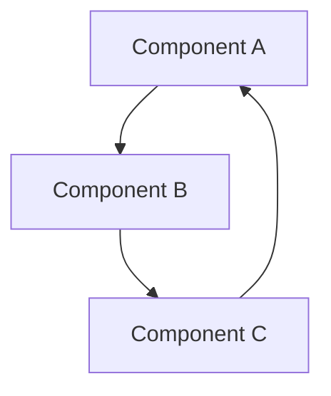

# Analytical Framework: <Framework Title>

## Core Insight

<1–3 sentence summary of the insight that only emerges from multi-angle analysis>

## Diagram

## Key Forces / Components

1. **<Force A>** — description
2. **<Force B>** — description
3. **<Force C>** — description

## Central Tensions

- <Tension 1>: <Angle X> pulls toward X, while <Angle Y> pulls toward Y
- <Tension 2>: ...

## Implications

- For practitioners: ...
- For policy: ...
- For future research: ...
