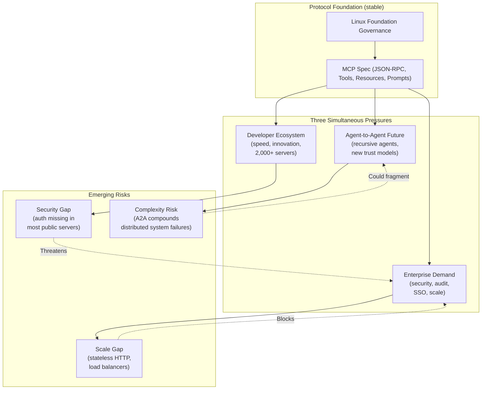

# Analytical Framework: The Open-Standard Trap

## Core Insight

MCP succeeded precisely because Anthropic gave up control — but that same act created a structural tension that will define MCP's future: the protocol must simultaneously serve the bottom-up innovation of individual developers, the top-down security and governance needs of enterprise, and the emerging architectural demands of Agent-to-Agent systems that the original design never anticipated. MCP didn't just solve the N×M integration problem; it created a new one at a higher level of abstraction.

## Diagram

## Key Forces / Components

1. **The N×M Resolver** — MCP's core value: replace N×M custom integrations with a single standard. This is proven and delivered. It is the stable foundation.

2. **The Ecosystem Flywheel** — More servers → more capable agents → more model adoption → more demand for servers. This is already spinning at 97M downloads/month and is self-reinforcing.

3. **The Security Debt** — Rapid developer adoption happened faster than security tooling matured. Auth is being retrofitted onto a standard that initially didn't require it. This is the most acute near-term risk.

4. **The Governance Neutralizer** — Linux Foundation donation converts "Anthropic standard" into "industry standard." This is a trust mechanism that accelerated adoption (OpenAI, Google, Microsoft all joined) but removed Anthropic's ability to steer.

5. **The A2A Inflection** — The 2026 roadmap shifts MCP from "tools for agents" to "agents coordinating with agents." This is a qualitative change in the protocol's role — from integration layer to coordination fabric — with compounding architectural complexity.

## Central Tensions

- **Speed vs. Security**: The developer community that built 2,000 MCP servers is the same community that deployed them without authentication. The ecosystem's greatest strength is also its most dangerous vulnerability.

- **Open Governance vs. Commercial Urgency**: Linux Foundation governance is optimized for consensus and long-term stability; enterprise customers need predictable roadmap delivery on quarterly timescales. These rhythms are incompatible.

- **Current Architecture vs. A2A Future**: The existing client-server model assumes a human-initiated Host at the top. Agent-to-Agent communication removes the human from the loop, invalidating the current trust and authorization model entirely. MCP must either extend cleanly or be partially redesigned.

- **Anthropic's Dilemma**: Anthropic benefits from MCP's success (more Claude integrations, more ecosystem value) but cannot capture that value directly (free standard, no revenue). The company's competitive advantage must come entirely from Claude's model quality — MCP is a gift to the industry that also raises the bar Anthropic itself must clear.

## Implications

**For practitioners (developers building on MCP):**
- Build for MCP now, but invest in auth from day one — retrofitting auth onto production deployments is expensive.
- Design MCP servers to be stateless where possible; the 2026 scalability work will favor stateless architectures.
- A2A is coming: design server capabilities with machine-to-machine (not just human-to-machine) callers in mind.

**For enterprise:**
- 2026 is the right year to move from pilot to production, but only with explicit security and audit requirements built into MCP server contracts.
- Evaluate MCP gateway products; the protocol itself won't solve enterprise auth — middleware will.
- The Assistants API sunset is not optional — plan migration timelines now.

**For future research:**
- The most interesting open question is whether MCP survives the transition to A2A, or whether A2A requires a fundamentally different abstraction (capabilities-based, not tool-based).
- The governance experiment is worth watching: can a standard body with competing commercial members (Anthropic, OpenAI, Google, Microsoft) actually deliver a coherent, security-hardened spec at commercial velocity?
