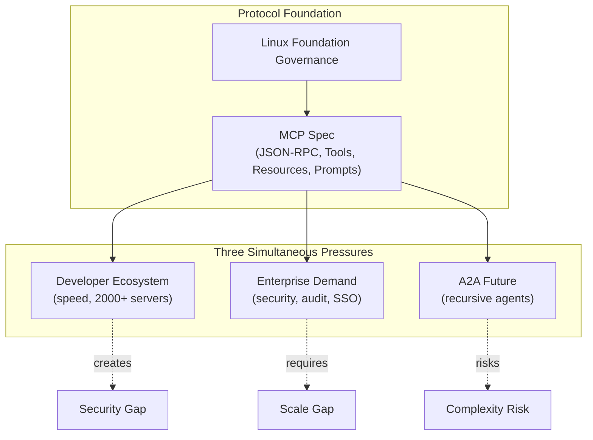

# Research Report: Model Context Protocol (MCP)

*Date: 2026-03-24 | Angles: Technical, Economic, Future Outlook*

---

## Executive Summary

- **MCP has won the AI integration standards war in 13 months.** Launched by Anthropic in November 2024, adopted by OpenAI in March 2025, and donated to the Linux Foundation in December 2025, MCP is now the de facto open standard for connecting AI agents to external tools and data — with 97M+ monthly SDK downloads and 2,000+ registered servers.
- **The core technical insight is elegant:** a client-server architecture over JSON-RPC 2.0 that exposes three primitives (Tools, Resources, Prompts), collapsing the N×M integration problem into N+M.
- **Anthropic's strategic bet paid off:** by open-sourcing MCP and ceding control to the Linux Foundation, Anthropic converted a proprietary protocol into an industry standard — forcing even OpenAI to adopt it and deprecate its own competing API.
- **Security is the most acute near-term risk:** a 2025 audit found that all verified publicly accessible MCP servers lacked authentication. Auth hardening (OAuth 2.1, DPoP) is on the 2026 roadmap but not yet delivered.
- **Agent-to-Agent (A2A) communication is the 2026 architectural frontier:** the roadmap extends MCP from Host→Server to Server→Server interactions, enabling recursive multi-agent systems — but introducing compounding complexity that the original design did not anticipate.
- **2026 is the enterprise transition year:** Gartner forecasts 40% of enterprise apps will include task-specific AI agents by end of 2026, and organizations like Block (75% time savings), Bloomberg, and Amazon have already deployed MCP organization-wide.
- **The core tension:** MCP must simultaneously serve fast-moving developers, security-conscious enterprises, and an A2A future that changes the protocol's fundamental trust model. These three constituencies have incompatible timelines and priorities.

---

## Technical Angle

MCP is built on a client-server architecture where a **Host** (e.g., Claude Desktop, an IDE) spawns isolated **Client** sessions, each connected to a separate **Server** via stateful JSON-RPC 2.0 channels.

**Three server-side primitives:**
- **Tools** — callable functions the AI can invoke (e.g., `create_github_issue`)
- **Resources** — structured data the AI can read
- **Prompts** — parameterized prompt templates

What distinguishes MCP from simpler function-calling APIs is **bidirectionality**: servers can also call back to the host via Sampling (request an LLM completion) and Elicitation (ask the user a question). This enables rich agentic loops.

**Transport**: stdio for local processes, Streamable HTTP for cloud deployments. The 2026 roadmap focuses on making Streamable HTTP production-ready at scale — stateless operation, load balancer compatibility, and session resumption.

**Security status**: As of June 2025, MCP servers are formally OAuth Resource Servers, with Client Identifier Metadata Documents (CIMD) to prevent token theft. However, real-world deployment has lagged — all tested public servers in 2025 lacked auth.

The closest historical analogy is the **Language Server Protocol (LSP)**, which standardized IDE-to-language-analyzer communication. MCP applies the same idea to AI agents and their tools.

---

## Economic Angle

MCP's economics are a textbook **platform strategy**: sacrifice short-term proprietary advantage for long-term ecosystem centrality.

Anthropic's calculation: open-source the integration layer (where it has no competitive advantage), accelerate ecosystem growth, make every MCP server increase the value of Claude. The moment OpenAI — Anthropic's primary competitor — adopted MCP, the strategy was validated.

**The decisive economic events of 2025:**
1. OpenAI adopts MCP (March 2025) — signals market consensus
2. Google DeepMind confirms MCP support — eliminates the "Anthropic-only" objection
3. Linux Foundation donation (December 2025) — converts "Anthropic standard" to neutral industry standard
4. OpenAI Assistants API deprecation announced (sunset mid-2026) — forces entire developer ecosystem to migrate

**Market size**: The MCP market is projected at $1.8B in 2025, driven by enterprise demand in healthcare, finance, and manufacturing. 2026 is positioned as the enterprise transition year.

**Who wins:** AI model providers, enterprise SaaS vendors (GitHub, Notion, Stripe all built MCP servers), cloud infrastructure players, and systems integrators.

**Who faces disruption:** iPaaS/workflow automation tools (Zapier, Make), custom AI integration startups, and anyone whose moat was the N×M integration complexity that MCP eliminates.

The Assistants API sunset is particularly significant: it is OpenAI forcing its own developers to adopt an Anthropic-originated standard — arguably the strangest competitive dynamic in recent tech history.

---

## Future Outlook Angle

The official 2026 roadmap has four priority areas:

| Priority | What it addresses |
|----------|------------------|
| **Transport Scalability** | Stateless Streamable HTTP, load balancer support, MCP Server Cards for discovery |
| **Agent-to-Agent (A2A)** | Server-to-server communication, recursive sub-agent architectures |
| **Enterprise Readiness** | Audit trails, SSO auth, governance tooling (as extensions, not core spec) |
| **Governance Maturation** | Working Groups, SEPs, community succession planning |

**A2A is the most significant architectural shift.** When MCP servers can call other servers as sub-agents, the original trust model (human at the top, agent in the middle, tool at the bottom) breaks down. Who authorizes a sub-agent? How do you audit a recursive agent chain? These questions don't have answers in the current spec.

**Macro context**: Gartner predicts 40% of enterprise apps with task-specific AI agents by end 2026, up from <5% today. MCP arrived at almost exactly the right moment to become the integration substrate for this wave.

**The open question that matters most**: Is MCP a permanent standard or a transitional layer? As LLMs become more capable (better context, native tool use, code execution), the need for a separate external integration protocol may diminish. MCP could be to AI agents what SOAP was to web services — important, widely adopted, and eventually superseded by something more elegant.

---

## Cross-Angle Comparison

### Commonalities Across All Three Angles

All three angles independently reach the same conclusions:
- MCP has won the standards war; the outcome is not in doubt
- Security is the critical near-term blocker for enterprise adoption
- A2A is the most important next architectural step
- The Linux Foundation governance was strategically correct

### Key Tensions

| Dimension | Technical | Economic | Tension |
|-----------|-----------|----------|---------|
| A2A timeline | Complexity risk; distributed systems compound | Urgency (Gartner 40% by 2026) | Ambitious roadmap vs. engineering reality |
| Security priority | Auth is a protocol feature to add | Auth failure = breach = trust collapse = adoption stall | Same risk, different severity framing |
| Governance pace | Community contributions take time | Enterprises need quarterly predictability | Open-source rhythm vs. commercial timelines |

### The Surprising Contradiction

**MCP's biggest risk is its own success.** The same developer momentum that created 2,000 servers in one year also created 2,000 servers without authentication. The protocol outran its own security model.

---

## Analytical Framework: The Open-Standard Trap

### Core Insight

MCP succeeded precisely because Anthropic gave up control — but that same act created a structural tension: the protocol must simultaneously serve developer speed, enterprise security, and an A2A future that the original design never anticipated. MCP didn't just solve the N×M integration problem; it created a new one at a higher level of abstraction.

### Diagram

### Key Tensions

1. **Speed vs. Security**: Developer innovation and security rigor are in direct tension; the ecosystem chose speed.
2. **Open Governance vs. Commercial Urgency**: Linux Foundation pace vs. enterprise quarterly timelines.
3. **Current Architecture vs. A2A**: The existing trust model assumes a human Host at the top — A2A removes that assumption entirely.

### Implications

- **Developers**: Implement auth from day one; design servers for stateless operation.
- **Enterprise**: 2026 is the right deployment year, but only with explicit security requirements; evaluate MCP gateway middleware.
- **Researchers**: Watch whether MCP's A2A extension succeeds or fragments; the governance experiment with competing commercial members is historically unusual.

---

## Conclusions and Open Questions

### Conclusions

1. MCP is the TCP/IP of the current agentic AI layer — not because it's technically perfect, but because network effects and governance choices made fragmentation too costly for competitors.
2. The security gap is the most dangerous near-term risk and must be addressed before enterprise adoption can reach its full potential.
3. A2A communication will be either MCP's triumphant evolution or the crack that eventually requires a successor standard.
4. Anthropic's open-source bet was strategically correct, even though it means the company that invented MCP now has no more formal control over it than OpenAI.

### Open Questions

- Will MCP survive the A2A transition without requiring a fundamental redesign?
- Can the Linux Foundation governance model deliver at commercial velocity when four major AI competitors are co-governing?
- What does a "trustworthy MCP ecosystem" require beyond protocol-level auth — curation, certification, insurance?
- Is MCP a permanent standard or a transitional layer that more capable models will eventually render unnecessary?

---

## Citations

- [MCP Specification 2025-11-25](https://modelcontextprotocol.io/specification/2025-11-25)
- [One Year of MCP — Model Context Protocol Blog](http://blog.modelcontextprotocol.io/posts/2025-11-25-first-mcp-anniversary/)
- [2026 MCP Roadmap — Model Context Protocol Blog](http://blog.modelcontextprotocol.io/posts/2026-mcp-roadmap/)
- [MCP Roadmap — Official Site](https://modelcontextprotocol.io/development/roadmap)
- [MCP Spec Updates June 2025 (Auth) — Auth0](https://auth0.com/blog/mcp-specs-update-all-about-auth/)
- [Model Context Protocol — Wikipedia](https://en.wikipedia.org/wiki/Model_Context_Protocol)
- [2026: The Year for Enterprise-Ready MCP — CData](https://www.cdata.com/blog/2026-year-enterprise-ready-mcp-adoption/)
- [A Year of MCP: From Internal Experiment to Industry Standard — Pento](https://www.pento.ai/blog/a-year-of-mcp-2025-review)
- [MCP Enterprise Guide — Deepak Gupta](https://guptadeepak.com/the-complete-guide-to-model-context-protocol-mcp-enterprise-adoption-market-trends-and-implementation-strategies/)
- [MCP's Growing Pains for 2026 — The New Stack](https://thenewstack.io/model-context-protocol-roadmap-2026/)
- [Thoughtworks on MCP Impact 2025](https://www.thoughtworks.com/en-us/insights/blog/generative-ai/model-context-protocol-mcp-impact-2025)
- [MCP as AI Standard — ByteIota](https://byteiota.com/mcp-how-model-context-protocol-became-the-ai-standard/)
